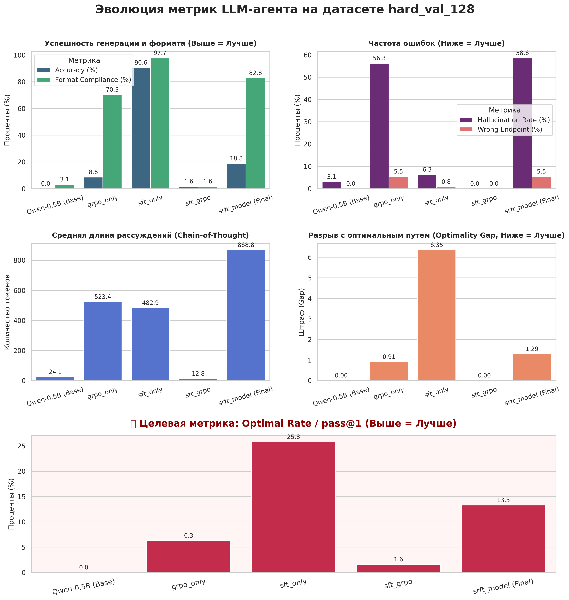
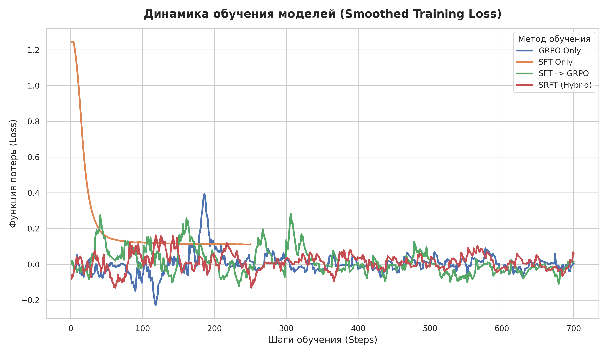

# Оптимизация агентных способностей Qwen 2.5 (0.5B) с помощью SFT и GRPO

## 1 Постановка задачи

Цель проекта — обучить ультракомпактную языковую модель (0.5B параметров) решать сложную алгоритмическую задачу поиска пути в графе.

Агент должен проанализировать условия (матрицу смежности, стартовый и конечный узлы), построить цепочку рассуждений и выдать итоговый маршрут в строгом XML-формате: сначала процесс принятия решений в тегах `<reasoning>`, затем итоговая последовательность узлов в тегах `<answer>`.

## 2 Проводимые эксперименты

Для выявления оптимальной стратегии обучения (Alignment) компактной модели были протестированы методы Supervised Fine-Tuning (SFT) и Group Relative Policy Optimization (GRPO). Базовая модель: `unsloth/Qwen2.5-0.5B-Instruct`.

Оценка проводилась на отложенном хард-датасете `hard_val_128` в режиме быстрого инференса (`pass@1`, жадная генерация, батч 8). Архитектура экспериментов разделена на 5 последовательных шагов:

| Шаг по ДЗ | Название эксперимента | Датасет для обучения | Датасет для валидации | Описание процесса |
| :--- | :--- | :--- | :--- | :--- |
| **Шаг 1** | Baseline оценка | *Обучение не проводится* | `val` и `Hard-val` | Замеряем `pass@k` и длину генерации на базовой модели Qwen2.5-0.5B-Instruct без дообучения. Доказываем, что на Hard-val `pass@128=0`. |
| **Шаг 2** | GRPO-only (без gold) | `curriculum+hard_train.pkl` (стандартный, без золотых траекторий) | `val` и `Hard-val` | Обучаем базовую модель только с помощью Curriculum GRPO и reward-функции через верификатор. |
| **Шаг 3.1** | SFT-only (Опционально) | `gold_train_128.pkl` (только собранные gold trajectories) | `val` и `Hard-val` | Обучаем базовую модель классическим Supervised Fine-Tuning на эталонных решениях. В задании сказано, что это полезно для декомпозиции эффектов. |
| **Шаг 3.2** | SFT $\rightarrow$ GRPO | `curriculum+hard_train.pkl` (с reward-функцией) | `val` и `Hard-val` | Берем веса модели, получившиеся на шаге 3.1 (после SFT), и дообучаем их с помощью Curriculum GRPO. |
| **Шаг 4** | SRFT (Выбранный метод) | `curriculum+gold_train.pkl` (смесь on-policy генераций и gold trajectories) | `val` и `Hard-val` | Берем базовую модель (Baseline) и обучаем её гибридным методом, совмещая SFT-сигнал и RL-награды в одном цикле обучения. |

## 3 Результаты

Эксперимент выявил фундаментальную разницу во влиянии SFT и GRPO на логику модели. В то время как SFT обеспечил радикальный рост всех метрик при генерации первого ответа (`pass@1`), внедрение GRPO спровоцировало эффект "длинных раздумий", но привело к резкому росту галлюцинаций.

**Сводная таблица результатов (на датасете hard_val_128, pass@1):**

| Метрика | Baseline (0.5B) | GRPO Only | SFT Only | SFT + GRPO | SRFT (Финальная) |
| :--- | :--- | :--- | :--- | :--- | :--- |
| **Accuracy** (Найден корректный путь) | 0.0% | 8.6% | **90.6%** | 1.6% | 18.8% |
| **Optimal Rate / pass@1** (Найден абсолютно оптимальный путь) | 0.0% | 6.3% | **25.8%** | 1.6% | 13.3% |
| **Format Compliance** (Соблюдение XML-разметки) | 3.1% | 70.3% | **97.7%** | 1.6% | 82.8% |
| **Hallucination Rate** (Построение пути по несуществующим ребрам) | 3.1% | 56.3% | **6.3%** | 0.0% | 58.6% |
| **Optimality Gap** (Штраф за неоптимальность маршрута) | 0.00 | **0.91** | 6.35 | 0.00 | 1.29 |
| **Reasoning Len** (Среднее число токенов в блоке рассуждений) | 24 | 523 | 483 | 13 | **869** |

### Ключевые выводы:

* **Триумф чистого SFT в pass@1:** Обучение с учителем (`SFT Only`) показало феноменальные результаты для «жадной» генерации. Модель научилась идеально соблюдать формат (97.7%) и доводить агента до цели в 90.6% случаев. Галлюцинации составили минимальные 6.3%. Модель уверенно выучила структуру графов из тренировочной выборки.
* **Галлюцинации при GRPO:** Попытка обучать модель через систему наград (`GRPO Only` и `SRFT Model`) привела к тому, что агент начал массово "срезать углы". Уровень галлюцинаций подскочил до 56-58% — модель строит пути там, где нет физических ребер графа, пытаясь обмануть метрику (Reward Hacking).
* **Эффект "Длинных раздумий" (Chain-of-Thought):** Финальная модель (`SRFT`) продемонстрировала классическое поведение RL-политики. Она генерирует почти 869 токенов в блоке `<reasoning>`. Модель усвоила, что длинная цепочка мыслей потенциально ведет к награде, поэтому "думает" дольше всех, даже если в итоге ошибается.
* **Коллапс при неудачном слиянии:** Конфигурация `SFT + GRPO` пережила катастрофическое забывание. Веса разрушились, и модель откатилась к состоянию хуже базовой: полное непонимание формата (1.6%) и отказ от рассуждений (всего 13 токенов). 

**Итог:** Для малогабаритных моделей (0.5B) классический SFT является наиболее стабильным и надежным методом усвоения алгоритмической логики при лобовом тестировании (`pass@1`). Внедрение GRPO наделяет агента способностью к глубоким рассуждениям (увеличение контекста размышлений), однако без жестких штрафов за невалидные переходы RLHF-алгоритм быстро деградирует в галлюцинации. Для раскрытия истинного потенциала финальной SRFT-модели с её длинными размышлениями требуется замер метрики `pass@128` (сэмплирование с температурой), где вариативность её ответов может превзойти детерминированность SFT-модели.

